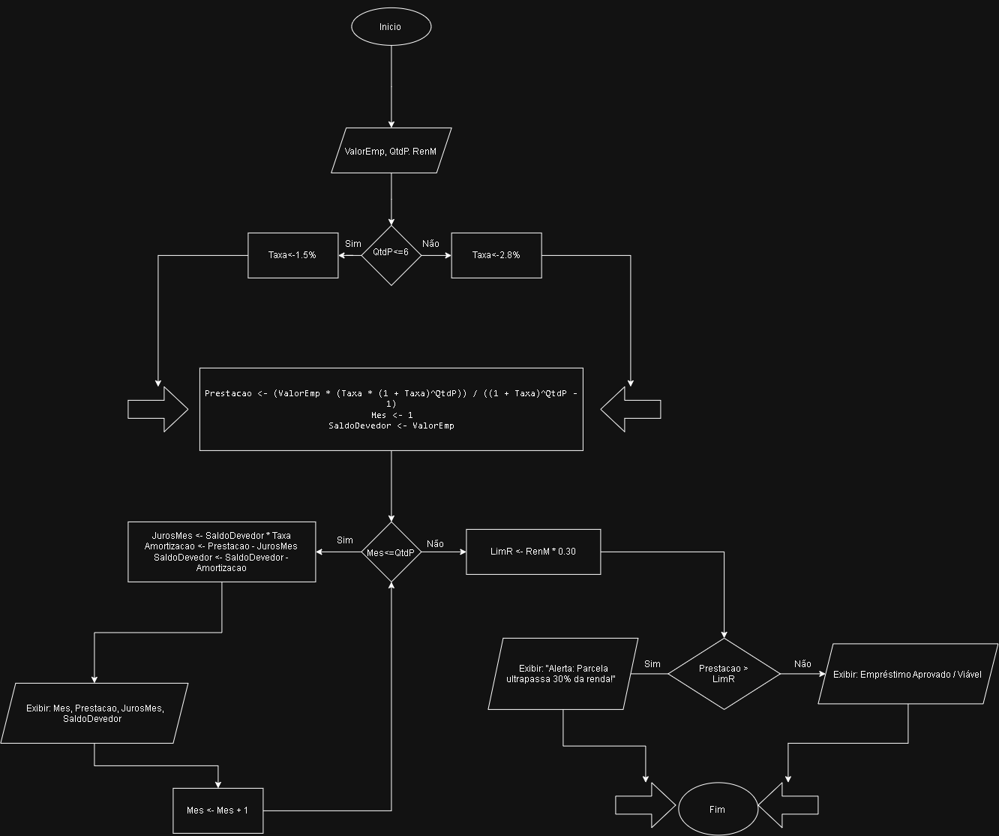

# Simulador de Empréstimos e Juros para MEI

## Visão Geral
O **Simulador de Empréstimos e Juros para MEI** é uma aplicação desenvolvida em Python para calcular, simular e auditar operações de microcrédito e financiamento voltadas a Microempreendedores Individuais. O sistema implementa matemática financeira (método de amortização Tabela Price), taxas de juros condicionais dinâmicas, controle de saldo devedor mês a mês via laços de repetição e uma auditoria automática de risco baseada no limite de renda.

## Funcionalidades Principais
* **Estruturas Condicionais (if/else):** Utilizadas para definir a taxa de juros de forma dinâmica (1,5% ao mês para prazos <= 6 meses e 2,8% ao mês para prazos superiores).
* **Fórmulas Matemáticas e Atribuições:** Aplicação da fórmula de financiamento tipo Tabela Price para o cálculo da prestação fixa.
* **Laços de Repetição (Loops):** Utilizados para iterar mês a mês, calculando individualmente os juros mensais, a amortização e atualizando o saldo devedor até a quitação total.
* **Validação de Renda e Alertas:** Regra lógica que calcula 30% da renda do usuário e dispara um alerta de risco caso a prestação comprometida ultrapasse esse limite de segurança .

## Especificações Técnicas
* **Linguagem:** Python 3.x
* **Paradigmas:** Programação procedural, lógica algorítmica e modelagem financeira aplicada.
* **Componentes de Lógica:**
  * Ramificação condicional para definição de taxas.
  * Avaliação de expressões matemáticas para parcelas fixas.
  * Iteração controlada para geração de extrato de amortização.
    
## Fluxograma do Projeto

 * Abaixo está o diagrama lógico que representa o fluxo de execução do sistema, desde a captura dos parâmetros até a auditoria de risco financeiro:




## Arquitetura do Fluxo de Execução
O fluxo do sistema segue etapas lógicas bem definidas:
1. **Entrada de Dados:** Aquisição do valor do empréstimo (`ValorEmp`), quantidade de parcelas (`QtdP`) e renda mensal (`RenM`).
2. **Atribuição de Taxa:** Verificação do prazo para estipular o percentual de juros aplicável.
3. **Cálculo da Prestação:** Execução da fórmula matemática de financiamento.
4. **Loop de Amortização:** Processamento iterativo do mês 1 até o prazo final, exibindo o extrato periódico.
5. **Auditoria de Risco:** Cálculo do teto de 30% da renda e validação final da viabilidade do crédito.

## Requisitos do Sistema
* Python 3.8 ou superior instalado na máquina.
* Nenhuma biblioteca externa necessária (desenvolvido inteiramente com bibliotecas nativas do Python).

## Instruções de Execução
1. Clone este repositório ou baixe os arquivos de código-fonte.
2. Abra o terminal ou prompt de comando na pasta do projeto.
3. Execute o script principal com o interpretador Python:
   ```bash
   python main.py
   ```
   ## Instruções de Execução

Siga as instruções exibidas no terminal para inserir os parâmetros do financiamento.

## Contexto do Projeto

Projeto desenvolvido para a disciplina de Práticas Técnicas em Informática / TIC (PTIC) do curso técnico em **Desenvolvimento de Sistemas** na **ETEC**, com foco em automação de regras de negócio e validação de dados.

## Autoria

* **Luan Vicktor Ferreira Moura**
